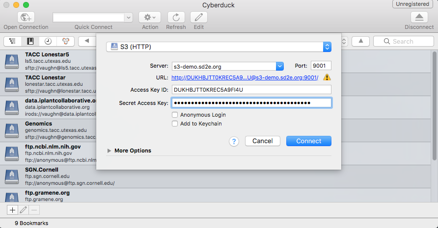

# Configuring S3 Clients for TACC S3 Endpoints

TACC officially supports the following S3 clients and libraries. Others may work - please consult the [Minio documentation][1] for guidance.
* s3cmd
* CyberDuck
* boto3 (AWS Python SDK)
* mc (Minio Client)
* aws-cli
* minfs (Docker volume plugin)

```
TACC_S3_ALIAS=s3-demo
TACC_S3_API=s3v4
TACC_S3_BUCKET=example-bucket
TACC_S3_KEY=DBJKH5A9FITT0KRECU4U
TACC_S3_REGION=us-east-1
TACC_S3_SECRET=hNGUhiGG8QC1zzJH91mOFushbcDMD1Yx1
TACC_S3_URI=s3-demo.sd2e.org:9001
```

## s3cmd

[S3cmd][3] is a free command line tool and client for uploading, retrieving and managing data in Amazon S3 and other cloud storage service providers that use the S3 protocol. Due to its broad compatibility, expressive set of configuration and usage options, and performance, it is TACC's recommended scriptable S3 client. 

### Configure

Either run `s3cmd --configure` to invoke interactive (re)configuration tool or create a config file at the top level of your user directory resembling the following:

```
host_base = s3-demo-sd2e.org:9001
host_bucket = s3-demo-sd2e.org:9001
bucket_location = us-east-1
use_https = False
signature_v2 = False
access_key = DBJKH5A9FITT0KRECU4U
secret_key = hNGUhiGG8QC1zzJH91mOFushbcDMD1Yx1
```

Then, use the s3cmd to manage data as described in its online documenation at the [S3tools.org][3] and [Minio][7] sites.

## CyberDuck

[Cyberduck][13] is a libre FTP, SFTP, WebDAV, Amazon S3, OpenStack Swift, Backblaze B2, Microsoft Azure & OneDrive, Google Drive and Dropbox browser for Mac and Windows. It is a great way to interact with TACC.cloud S3 endpoints. At present, because our S3 service is not secured with HTTPS, you will need to install a connection profile to configure Cyberduck properly. 

### Configure

1. Download this connection profile: [S3 (HTTP).cyberduckprofile][12]
2. Double-click it to install it into CyberDuck. When prompted, enter the following to establish a connection.

Server: s3-demo-sd2e.org
Port: 9001
Access Key ID: DBJKH5A9FITT0KRECU4U
Secret Key ID: hNGUhiGG8QC1zzJH91mOFushbcDMD1Yx1



The makers of CyberDuck also offer "Mountain Duck", an application for creating desktop-mounted volumes. You can find details for how to use it at the [Minio web site][14].

## Boto3

Boto is the Amazon Web Services (AWS) SDK for Python, which allows Python developers to write software that makes use of Amazon services like S3 and EC2. Boto provides an easy to use, object-oriented API as well as low-level direct service access. There's extensive documentation on using Boto3 at its [readthedocs site][15]. 

### Example


```python
import boto3
from botocore.client import Config

s3 = boto3.client('s3',
                  endpoint_url='http://s3-demo.sd2e.org:9001',
                  aws_access_key_id='DBJKH5A9FITT0KRECU4U',
                  aws_secret_access_key='hNGUhiGG8QC1zzJH91mOFushbcDMD1Yx1',
                  config=Config(signature_version='s3v4'),
                  region_name='us-east-1')


# List all buckets
response = s3.list_buckets()
for bucket in response['Buckets']:
    print(bucket['Name'])

# Listing files in a specific bucket
for key in s3.list_objects(Bucket='example-bucket')['Contents']:
    print(key['Key'])

```

## Minio Client

Minio ships a very nice S3 client called [mc][1] that is compatible not only with Minio S3 but also Amazon's implementation. The current S3 service has been tested with client version [RELEASE.2017-10-14T00-51-16Z][2]. Subsequent versions should work fine. Older releases may not.

### Configure

```
mc config host add sd2e http://s3-demo.sd2e.org:9001 DBJKH5A9FITT0KRECU4U hNGUhiGG8QC1zzJH91mOFushbcDMD1Yx1 S3v4
```

Then, use the client as described in its [online guide][1].

## aws cli

AWS CLI is a unified command line tool to manage AWS services. It can be used to interoperate with non-AWS S3 services. Detailed usage information on the [s3-specific commands][5] is available. 

### Configure

Run `aws configure` and specify Minio-specific details as follows:

```
aws configure
AWS Access Key ID [None]: DBJKH5A9FITT0KRECU4U
AWS Secret Access Key [None]: hNGUhiGG8QC1zzJH91mOFushbcDMD1Yx1
Default region name [None]: us-east-1
Default output format [None]: ENTER
```

Then, run the following to set the API signature correctly:

`aws configure set default.s3.signature_version s3v4`

### Usage

The AWS CLI is less forgiving of non-AWS usage. Thus, you must always remember to specify an "endpoint URL" when using it with such services. Here's an example of listing our TACC-hosted "example-bucket":

```
aws --endpoint-url http://s3-demo.sd2e.org:9001 s3 ls s3://example-bucket/
```

See "[AWS CLI with Minio][6]" for more details on usage specifics.

## minfs Docker Volume Driver

There's an intriguing [Docker volume driver][8] for Minio S3 that allows one to create a Docker volume that uses an S3 bucket as its backing store. Caching is taken care of automatically, within the limits of the eventual consistency provided by the S3 protocol. TACC provides a [pre-built version of this plugin at Docker Hub][9] which you are free to use. There are extensive instructions on how to use Docker Compose to build and link to volumes at the [MinFS source repository][10]. 

### Usage

Here's how to manually create a volume and link a container to it: 

```
docker volume create -d tacc/minfs \
  --name "example-minfs-volume" \
  -o endpoint=http://s3-demo.sd2e.org:9001 \
  -o access-key=DBJKH5A9FITT0KRECU4U \
  -o secret-key=hNGUhiGG8QC1zzJH91mOFushbcDMD1Yx1 \
  -o bucket=example-bucket \
  -o opts=cache=/tmp/example-minfs-volume
```

You will be able to confirm it with `docker volume ls`. Here's an example:

```
DRIVER              VOLUME NAME
local               e245b1388ef40e2585585b370d963c385126009e46fa4839e7503f82cf6ebb88
tacc/minfs:latest   example-minfs-volume
local               synbiohub
```

Now, create and mount a consumer container:

```
docker run -it -v example-minfs-volume:/home ubuntu:xenial bash
```

File system actions you take inside `/home` in the container will be reflected directly in `example-bucket`. 

:warning: **S3 is an eventually-consistent protocol and FUSE, upon which the minfs plugin is based, caches extensively. Do not use the minfs Docker volume plugin for use cases that require a high degree of filesystem integrity or correctness**. 

[1]: https://docs.minio.io/docs/minio-client-complete-guide
[2]: https://github.com/minio/mc/releases/tag/RELEASE.2017-10-14T00-51-16Z
[3]: http://s3tools.org/s3cmd
[4]: https://aws.amazon.com/cli/
[5]: http://docs.aws.amazon.com/cli/latest/reference/s3/index.html
[6]: https://docs.minio.io/docs/aws-cli-with-minio
[7]: https://docs.minio.io/docs/s3cmd-with-minio
[8]: https://docs.docker.com/engine/extend/plugins_volume/
[9]: https://hub.docker.com/r/tacc/minfs/
[10]: https://github.com/minio/minfs/tree/master/docker-plugin#a-docker-volume-plugin-for-minfs
[11]: https://trac.cyberduck.io/wiki/help/en/howto/s3#HTTP
[12]: https://svn.cyberduck.io/trunk/profiles/S3%20(HTTP).cyberduckprofile
[13]: https://cyberduck.io/?l=en
[14]: https://docs.minio.io/docs/how-to-use-mountain-duck-with-minio
[15]: http://boto3.readthedocs.io/en/latest/index.html

